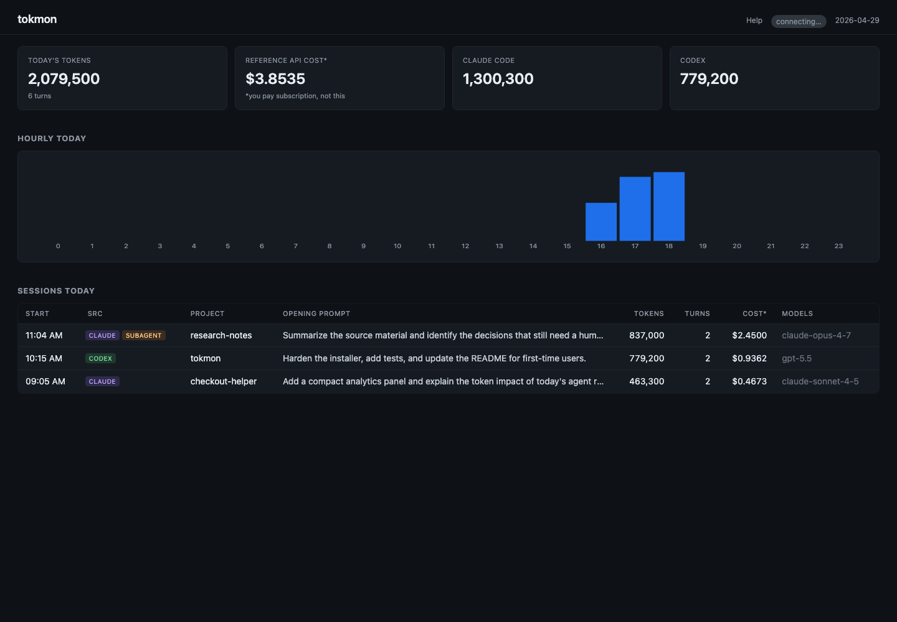
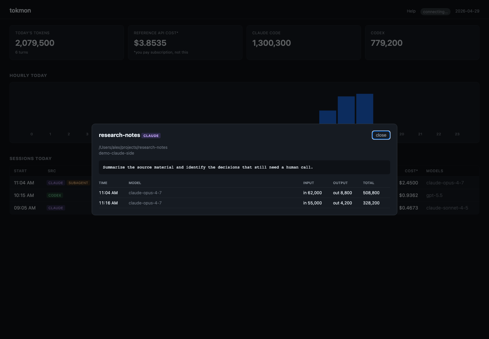

# tokmon

Local live token-usage monitor for Claude Code and Codex.

tokmon reads the JSONL session logs that Claude Code and Codex already write,
stores usage in SQLite, and serves a local dashboard at
`http://127.0.0.1:4001`.

It does not require API key changes, shell aliases, or wrapping your editor.





## What Works Today

tokmon currently supports:

- Claude Code: `~/.claude/projects/**/*.jsonl`
- Codex: `~/.codex/sessions/**/*.jsonl`

It can be expanded to other LLM tools later. The intended expansion path is a
thin monitoring layer that can sit above provider-normalization systems like
LiteLLM, while keeping the dashboard and storage model local.

## Install

Requirements: macOS, Python 3.11 or newer, and either Claude Code or Codex.

```bash
git clone <repo-url>
cd tokmon
bash scripts/install.sh
```

Then open:

```text
http://127.0.0.1:4001
```

That is it. The installer:

- creates `.venv`
- installs pinned Python dependencies from `requirements.txt`
- writes a launchd service for your actual checkout path
- starts tokmon now and on future logins

Logs are written to:

```text
~/.openclaw/logs/tokmon.log
```

The SQLite database is written to:

```text
data/tokmon.db
```

## Using tokmon

The dashboard shows:

- today's total tokens, turns, and reference API cost
- Claude Code vs. Codex token split
- hourly token bars in your local timezone
- session list with project, opening prompt, models, turns, and tokens
- per-turn details when you click a session
- live updates through server-sent events

The cost number is a reference estimate only. It uses approximate published API
prices so you can spot expensive sessions. It is not your real bill, especially
if you use subscription products.

## Help Page

The running app includes a short Help page linked from the top right of the
dashboard:

```text
http://127.0.0.1:4001/docs
```

The Help page is intentionally shorter than this README so new users can get
unstuck without leaving the app.

## Stop Or Restart

Stop:

```bash
launchctl bootout gui/$(id -u) ~/Library/LaunchAgents/com.tokmon.monitor.plist
```

Start:

```bash
launchctl bootstrap gui/$(id -u) ~/Library/LaunchAgents/com.tokmon.monitor.plist
```

Restart:

```bash
launchctl bootout gui/$(id -u) ~/Library/LaunchAgents/com.tokmon.monitor.plist 2>/dev/null || true
launchctl bootstrap gui/$(id -u) ~/Library/LaunchAgents/com.tokmon.monitor.plist
```

## Configuration

Most users do not need any configuration. tokmon infers paths from the checkout
location and from the standard Claude Code and Codex log directories.

Advanced overrides:

| Variable | Default | Purpose |
| --- | --- | --- |
| `TOKMON_HOST` | `127.0.0.1` | bind address |
| `TOKMON_PORT` | `4001` | dashboard port |
| `TOKMON_DB_PATH` | `data/tokmon.db` | SQLite database path |
| `TOKMON_DATA_DIR` | `data` | database directory when `TOKMON_DB_PATH` is unset |
| `TOKMON_LOG_DIR` | `~/.openclaw/logs` | launchd log directory used by the installer |
| `TOKMON_CLAUDE_GLOB` | `~/.claude/projects/**/*.jsonl` | Claude Code log glob |
| `TOKMON_CODEX_GLOB` | `~/.codex/sessions/**/*.jsonl` | Codex log glob |

Example:

```bash
TOKMON_PORT=4010 bash scripts/install.sh
```

## LiteLLM And Security

tokmon's v1 ingestion path for Claude Code and Codex reads local log files. It
does not proxy those tools through LiteLLM.

The broader design treats tokmon as the dashboard/storage layer above local LLM
tooling. For tools that need a proxy or provider-normalization layer, the
expected expansion path is a LiteLLM-backed ingestion source. That LiteLLM path
should use exact pinned versions, not floating installs.

LiteLLM has had security-sensitive issues, so be conservative: pin versions,
watch upstream advisories, do not expose proxies publicly, and run it at your own
risk. Pinning reduces supply-chain drift, but it does not make any proxy
automatically safe.

## Development

Set up dependencies:

```bash
python3 -m venv .venv
. .venv/bin/activate
pip install -r requirements.txt
```

Run locally:

```bash
python -m tokmon
```

Run tests:

```bash
pytest
```

## Data Model

tokmon stores:

- `sessions`: source, project, working directory, opening prompt, models
- `turns`: timestamp, token counts, local day/hour bucket, reference cost
- `file_offsets`: last ingested byte offset for each JSONL file

The database is local SQLite. No usage data is sent anywhere by tokmon.

## Roadmap

- Gemini CLI ingestion
- multi-day comparison views
- project-level rollups
- cache hit-rate dashboard
- model-tier suggestions
- optional LiteLLM-backed ingestion for tools that need a proxy layer
